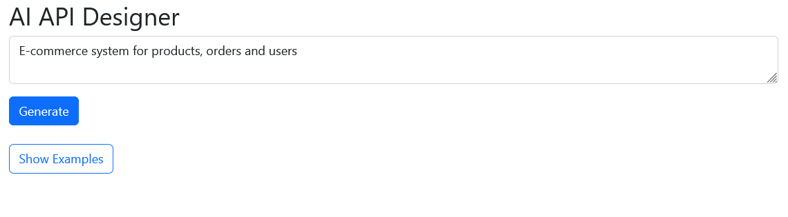
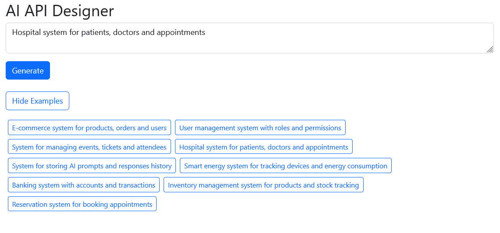
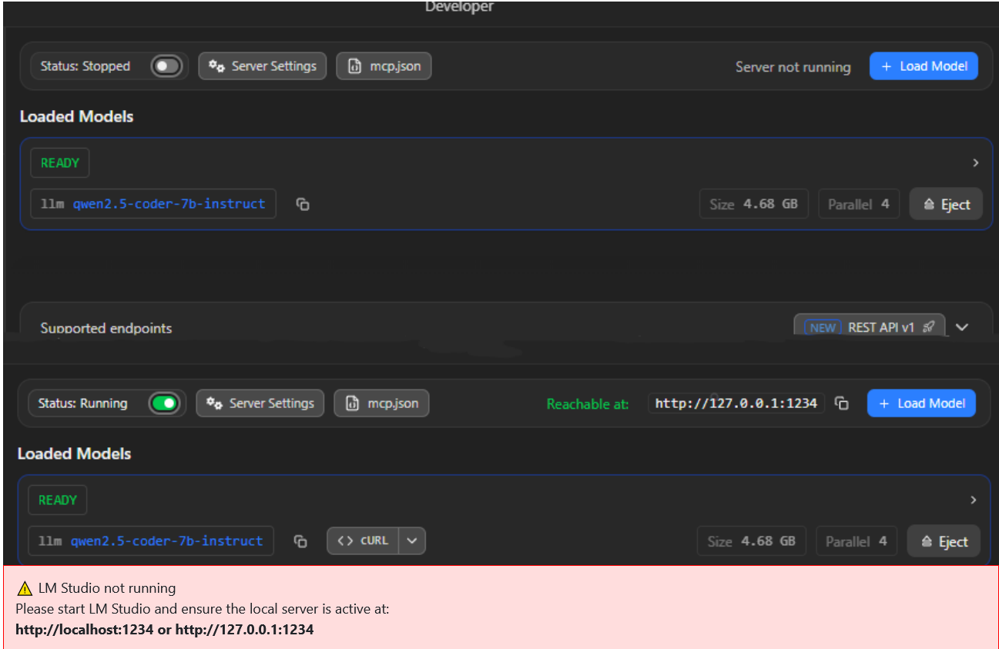
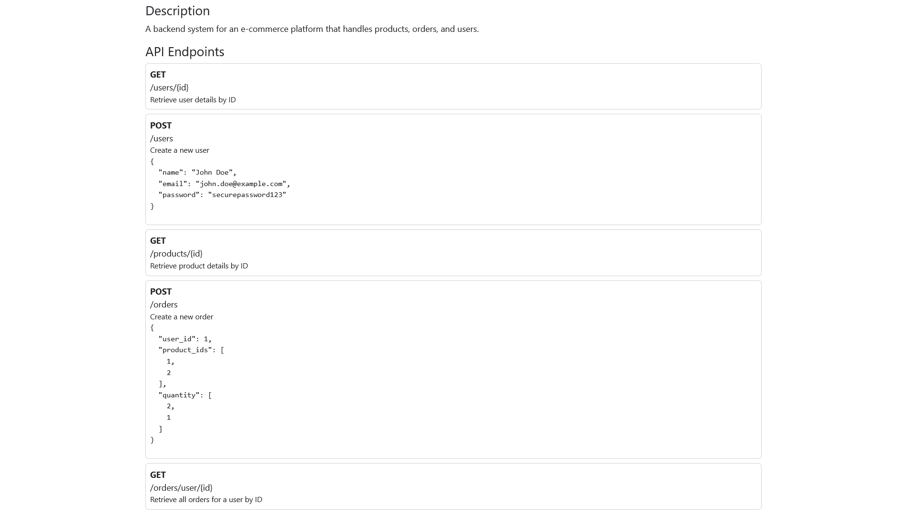
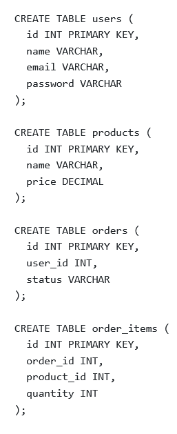

# 🚀 AI API Designer (Local AI System)

## 📌 Overview

AI API Designer is a local AI-powered tool that helps generate:

* REST API design
* Database schema
* Example request/response structures

The system uses a **local AI model via LM Studio**, meaning:

* ✅ No cloud AI required
* ✅ Works fully offline
* ✅ Your data stays private

---

## 🎯 Problem

Developers and analysts often need to quickly design backend systems, APIs, and database structures.

Manual design takes time and slows down prototyping.

---

## 💡 Solution

This tool automatically generates:

* API endpoints
* Database schema
* Example request and response data
* SQL schema (MySQL / SQLite)

Using local AI, the system provides **instant backend design suggestions**.

---

## ✨ Features

* Generate REST API endpoints
* Generate database schema
* Generate example request/response
* SQL generator (MySQL / SQLite)
* ER Diagram generator (Mermaid.js)
* Download ER diagram as PNG
* Copy SQL to clipboard
* Download SQL file
* Example prompts for quick testing
* Works fully offline (LM Studio)

---

## 🏗️ Architecture

```
User (Browser / Android / Desktop)
        ↓
PHP Backend (api.php)
        ↓
LM Studio REST API (localhost:1234)
        ↓
Local AI Model (LLM)

Output:
JSON → parsed → HTML UI + SQL Generator
```

---

## 🧰 Tech Stack

* PHP 8+
* Vanilla JavaScript (XMLHttpRequest)
* Bootstrap 5 (local assets)
* LM Studio (Local AI)
* REST API

---

## ⚙️ Requirements

* Windows / Linux / MacOS
* PHP 8+
* Web browser (Chrome, Firefox, Edge)
* LM Studio

---

## 🚀 How to Run

1. Start LM Studio API
2. Start Apache (XAMPP or similar)
3. Open in browser:

```
http://localhost/ai-api-designer/index.php
```

---

## 🤖 AI Setup (LM Studio)

### 1. Install LM Studio

👉 https://lmstudio.ai/

---

### 2. Download Recommended Model

Open **Model Search** in LM Studio and install:

Recommended model:

* ✅ `qwen2.5-coder-7b-instruct`

Why this model?

* Best SQL generation quality
* Most stable JSON output
* Better API/database structure generation
* Optimized for programming tasks

Other general-purpose models may generate invalid JSON or incorrect SQL schemas.
---

### 3. Load model

* Go to **Local Models**
* Click model
* Press **Load**

---

### 4. Start server

* Go to **Local Server**
* Click **Start Server**

Default:

```
http://localhost:1234
```

---

## 📥 Example Prompts

You can test with:

1. E-commerce system for products, orders and users
2. User management system with roles and permissions
3. System for managing events, tickets and attendees
4. Hospital system for patients, doctors and appointments
5. System for storing AI prompts and responses history
6. Smart energy system for tracking devices and energy consumption
7. Banking system with accounts and transactions
8. Inventory management system for products and stock tracking
9. Reservation system for booking appointments

---

## 📤 Output

The system returns structured JSON:

* API endpoints
* Database schema
* Example request/response

Which is then converted into:

* UI display
* SQL schema

---

## 📸 Screenshots

### Main



### Error No response from AI


### AI LM Studio Generate REST API endpoints 


### AI LM Studio Generate SQL 


---

## ⚠️ Troubleshooting

### Invalid SQL or broken JSON

If generated SQL is incorrect or JSON parsing fails:

* Use `qwen2.5-coder-7b-instruct`
* Some general-purpose models are not optimized for backend/API generation
  
### No response from AI

* Make sure LM Studio is running
* Check API URL: `localhost:1234`

### Slow response

* Use smaller model (7B)
* Close other applications

### JSON parse error

* Model returned invalid JSON
* Retry or switch model

---

## 🔄 Alternative (Cloud AI)

The system can be adapted to use:

* OpenAI API
* Google Gemini
* Other cloud AI providers

Change endpoint in:

```php
$LM_STUDIO_URL = "http://localhost:1234/v1/chat/completions";
```

---

## 👤 Author

**Željko Fabek**

Self-taught developer with focus on:

* PHP backend development
* REST API systems
* Android (Java) applications
* Local AI integration (LM Studio)

---

## 🚀 Future Improvements

* PDF export
* Android client integration
* Desktop Java client
* Cloud AI support
* User authentication

---

## 📄 License

This project is open-source and available for learning and experimentation.

---
